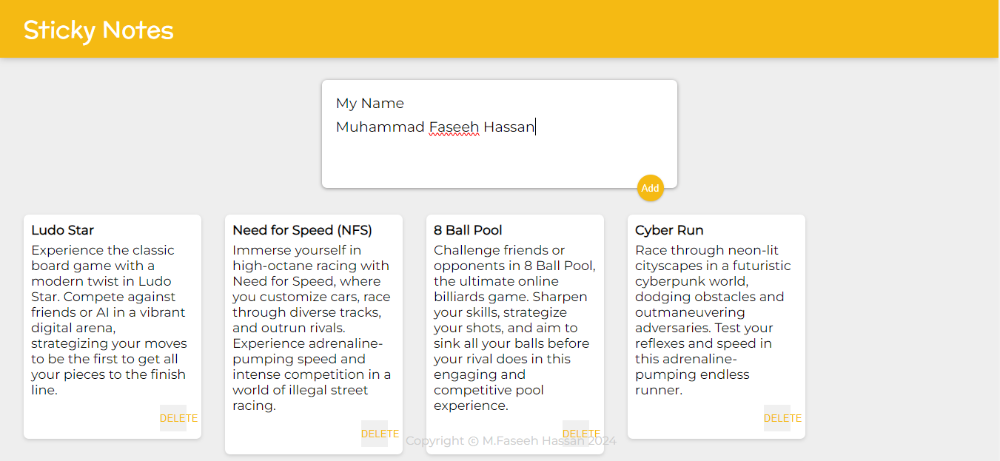

## Sticky Notes "Take your Notes on a Click"

## Using vite + React made easier for everyone!

<h2 align="center">
  <a href="https://sticky-notes-react-faseeh.vercel.app/" target="_blank">Sticky-Notes-React-Faseeh.vercel.app</a>
</h2>

<div align="center">
  
</div>

<br/>


## Built With

This project was built using these technologies.

- Node.js
- Vite Css
- Javascript
- VsCode
- Html

## Features

**📃 Markdown Support**

**✏️ Easy to customize and write of your own**

**🎨 Styled with Vite Css**

## Getting Started

### 🛠 Installation and Setup Instructions

To get started just clone this repository. You will need `node.js` and `git` installed globally on your machine.

Run

```
npm install
```

```
npm run dev
```

Open [http://localhost:3000](http://localhost:3000) with your browser to see the result.

## Usage Instructions

To write your own create a markdown file in `_content` folder with the specified format.

### Show your support

Give a ⭐ if you like this website!

<a href="https://www.buymeacoffee.com/faseeh41" target="_blank"></a>
